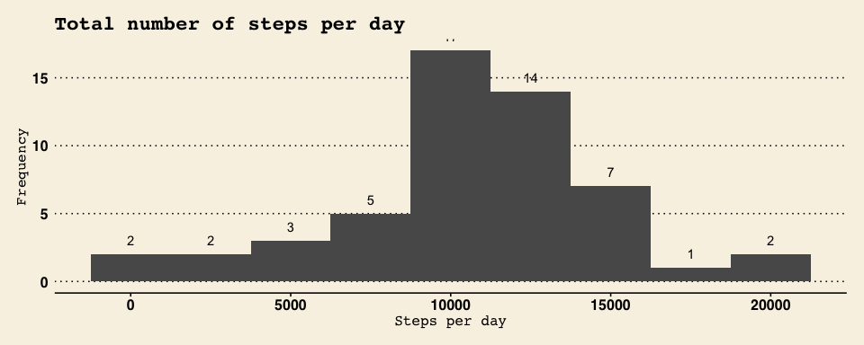
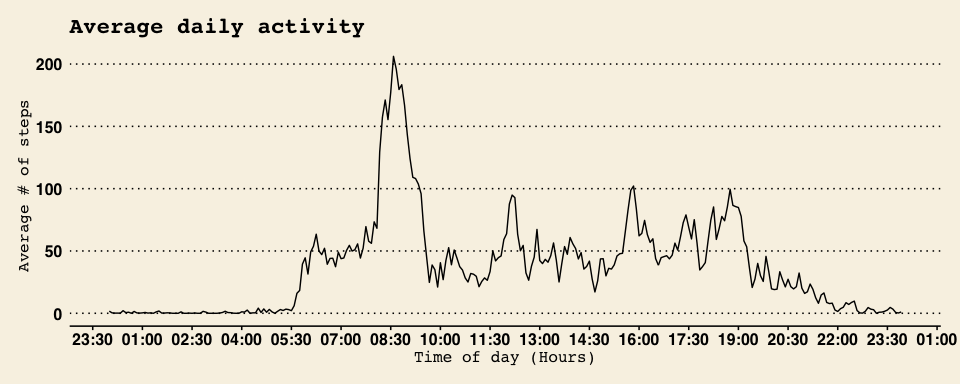
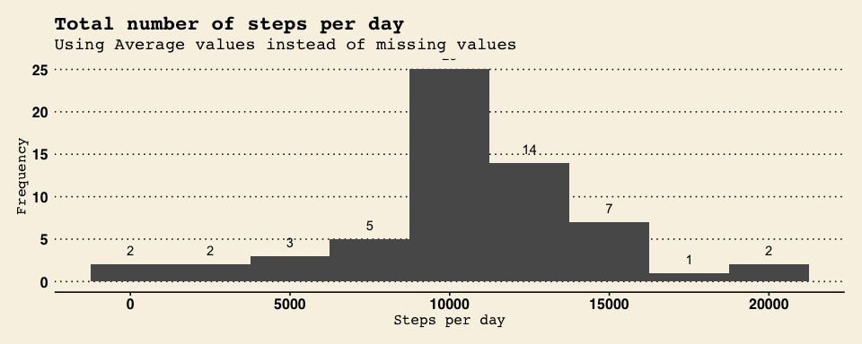
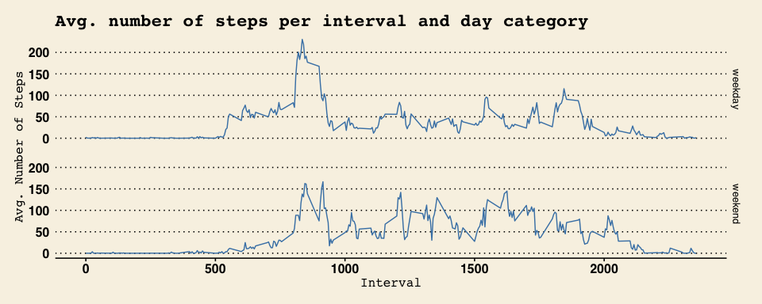

## Loading and preprocessing the data

```r
library(dplyr)
library(ggplot2)
library(ggthemes)
library(lubridate)
library(stringr)
library(scales)

#Loading the original csv file.
activity <- read.csv('activity.csv')

#Defining figure size for the whole document.
knitr::opts_chunk$set(fig.width=10, fig.height=4) 
```
For this analysis there is no need to reprocess the data to answer the questions listed below.

## What is mean total number of steps taken per day?

1. Calculate the total number of steps taken per day.

```r
d1 <- activity %>% 
    filter(!is.na(steps)) %>%
    group_by(date) %>% 
    summarize(sum(steps)) %>% 
    rename(total_steps = 'sum(steps)')

# The total number of steps taken per day are recorded in the table d1.  
# This is an example with some of the values:
head(d1)
```

```
## # A tibble: 6 x 2
##   date       total_steps
##   <fct>            <int>
## 1 2012-10-02         126
## 2 2012-10-03       11352
## 3 2012-10-04       12116
## 4 2012-10-05       13294
## 5 2012-10-06       15420
## 6 2012-10-07       11015
```

2. Make a histogram of the total number of steps taken each day.

```r
#histogram of the total number of steps taken each day
ggplot(data=d1, aes(x=total_steps)) + 
    geom_histogram(binwidth= 2500) + 
    stat_bin(binwidth= 2500, geom="text", aes(label=..count..), vjust = -1) + 
    theme_wsj() + 
    theme(axis.title=element_text(size=12)) + 
    theme(title=element_text(size=14)) + 
    xlab("Steps per day") +
    ylab("Frequency") + 
    ggtitle('Total number of steps per day')  
```

<!-- -->

3. Calculate and report the mean and median of the total number of steps taken per day.

```r
mean_per_day <- mean(d1$total_steps)
median_per_day <- median(d1$total_steps)
```
The mean of the total number of steps taken per day is: **10766.19**

The median of the total number of steps taken per day is: **10765**

## What is the average daily activity pattern?

1. Make a time series plot of the 5-minute interval (x-axis) and the average number of steps taken, averaged across all days (y-axis)

```r
#getting the average # of steps per 5 minutes interval for all days combined.
d2 <- activity %>% 
    filter(!is.na(steps)) %>%
    group_by(interval) %>% 
    summarize(mean(steps)) %>% 
    rename(average_steps = 'mean(steps)')

# adding a column interval2, that represent the 5 minutes interval in a datetime field.
d2 <- mutate(d2, interval2 = as.POSIXct(strptime(paste(substr(str_pad(interval, 4, 'left', '0'),1,2), ':', substr(str_pad(interval, 4, 'left', '0'),3,4), ':00', sep="") , format('%H:%M'))) )


# creating the plot. 
ggplot(data=d2, aes(x=interval2, y=average_steps)) +
    geom_line() +
    scale_x_datetime(breaks = date_breaks("90 mins"),
                     labels = date_format("%H:%M", tz = "America/Montreal")) +
    theme_wsj() +
    theme(axis.title=element_text(size=12)) + 
    theme(title=element_text(size=14)) + 
    xlab("Time of day (Hours)") +
    ylab('Average # of steps') +
    ggtitle('Average daily activity') 
```

<!-- -->

2. Which 5-minute interval, on average across all the days in the dataset, contains the maximum number of steps?

```r
max_n_steps <- d2[d2$average_steps == max(d2$average_steps),3]
hour(max_n_steps[[1]])  # 8
minute(max_n_steps[[1]]) #35
minute(max_n_steps[[1]]) + 4  #39
```

The maximum number of steps in average happened between **8:35** and **8:39**.

## Imputing missing values

1. Calculate and report the total number of missing values in the dataset.

```r
#1.Calculate the total number of missing values in the dataset
d3 <- filter(activity, is.na(steps))
numbers_missing_values <- nrow(d3)
```
There are **2304** missing values in the original dataset.

2. Devise a strategy for filling in all of the missing values in the dataset. 

As a method to filling in the missing data, I will use the **mean for that 5-minute interval**.


```r
# getting average # of steps per interval using previous dataset d2.
a <- sapply(d3$interval, function(x) {d2[d2$interval == x,2]})

# converting list in a dataframe.
b <- data.frame(matrix(unlist(a), nrow=length(a), byrow=T))

# combining dataframes NA values with the average value of not null ones per interval. 
d3 <- cbind(d3,b)

# deleting the NA column and renaming the new variable
d3 <- d3 %>%
    select(-steps) %>%
    rename(steps = 'matrix.unlist.a...nrow...length.a...byrow...T.')
```

3. Create a new dataset that is equal to the original dataset but with the missing data filled in.

```r
# change the order of the dataframe to match the original dataframe.
d3 <- select(d3,steps, date, interval)

# adding the new averaged values to the original dataset.
d3complete <- rbind(activity, d3)

# eliminate the NA values, now redundant
d3complete <- filter(d3complete, !is.na(steps))
```

4. Make a histogram of the total number of steps taken each day and Calculate and report the mean and median total number of steps taken per day.

```r
d3complete_perday <- d3complete %>% 
    group_by(date) %>% 
    summarize(sum(steps)) %>% 
    rename(total_steps = 'sum(steps)')

ggplot(data=d3complete_perday, aes(x=total_steps)) + 
    geom_histogram(binwidth= 2500) + 
    stat_bin(binwidth= 2500, geom="text", aes(label=..count..), vjust = -1) + 
    theme_wsj() + 
    theme(axis.title=element_text(size=12)) + 
    theme(title=element_text(size=14)) + 
    xlab("Steps per day") +
    ylab("Frequency") + 
    ggtitle('Total number of steps per day')  +
    labs(subtitle='Using Average values instead of missing values')
```

<!-- -->

```r
mean_per_day_full <- mean(d3complete_perday$total_steps)
median_per_day_full <- median(d3complete_perday$total_steps)
```

Including the filling in data:

- The mean of the total number of steps taken per day is: **10766.19**
- The median of the total number of steps taken per day is: **10766.19**

Comparing these values to the estimates in the first part of the assigment:

- The mean is the same in both datasets, the median varies by 1.19 steps.
- There is almost not impact of using the average values in the estimation of total number of steps.

## Are there differences in activity patterns between weekdays and weekends?

1. Create a new factor variable in the dataset with two levels – “weekday” and “weekend” indicating whether a given date is a weekday or weekend day.

```r
# using the dataset with the filled-in missing values calculated in the previous exercise.
d4 <- d3complete

# creating a new factor variable in the dataset with two levels.
d4 <- mutate(d4, weekday = as.factor( ifelse( wday(d4$date)==1 | wday(d4$date)==7, "weekend", "weekday" )))
```

2. Make a panel plot containing a time series plot of the 5-minute interval (x-axis) and the average number of steps taken, averaged across all weekday days or weekend days (y-axis).

```r
# dataset with the average # of steps per interval and weekday
d4_final <- d4 %>% 
    group_by(interval, weekday) %>% 
    summarize(mean(steps)) %>% 
    rename(average_steps = 'mean(steps)') 

# creating the time series plot.
ggplot(data=d4_final, aes(x=interval, y=average_steps)) + 
    geom_line(color = "steelblue") +
    facet_grid(weekday ~ .) + 
    theme_wsj() + 
    theme(axis.title=element_text(size=12)) + 
    theme(title=element_text(size=14)) + 
    xlab("Interval") +
    ylab("Avg. Number of Steps") +
    ggtitle('Avg. number of steps per interval and day category')
```

<!-- -->

The graph show some difference in the average number of steps per day category:

- Early morning, there are more activity on weekdays than weekends. 
- However, during lunch time and late nights the opposite happens.

Author: Elmer Ore
